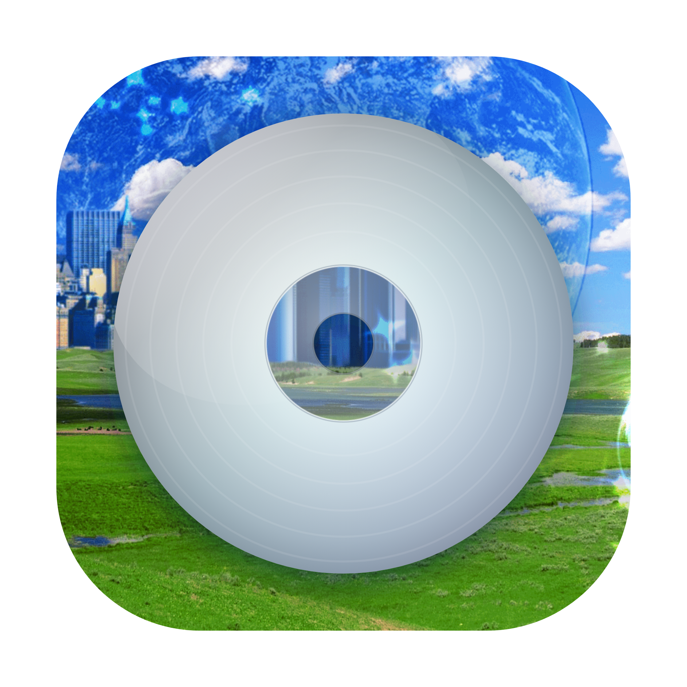

<div align="center">
  
  <h1>Music Player</h1>
  <p>A local, Spotify-like desktop music player for your own files — 100% offline.</p>
</div>

A clean, fast player for a folder of local music. It reads your files' tags and cover art and
gives you a unified, searchable library, playlists, a queue, smart playlists, and listening recaps —
all computed and stored **on your machine**. Nothing is uploaded; there are no accounts and no network calls.

## Features

- **Unified library** — every song in one place, sortable by title / artist / album / genre / year / duration. Your files are never moved or modified.
- **Browse** by Songs, Albums, Artists, and **Recently Added**.
- **Search** across titles, artists, and albums (accent- and case-insensitive; handles non-Latin text).
- **Playlists** with a name + description, drag-to-reorder, and right-click *Add to playlist*.
- **Queue** — *Play next* / *Add to queue*, a slide-in queue panel, reorder & clear.
- **On Repeat** — a weekly auto-playlist of your most-played tracks.
- **Discover Mix** — a weekly, content-based recommendation playlist (genre / artist / era + your play history).
- **Autoplay** — keeps playing similar songs when the queue runs out.
- **Recaps** — Wrapped-style Weekly / Monthly / Yearly summaries (top tracks, artists, albums, minutes), computed locally.
- **Now Playing** — play/pause, prev/next, seek, shuffle, repeat; macOS **Dock right-click** controls and **media keys** / Control Center.
- **Background playback** — closing the window keeps the music playing; **⌘Q** (or pausing) stops it.
- **Drag & drop** — drop songs or whole album folders onto the window to add them (remembered across launches).
- **Sample music included** — a few Creative Commons tracks are copied into your library on first launch, so there's something to play right away.
- **Themes** — dark / light / match-system, plus **11 accent colors** (5 warm, 5 cool, + grey).
- Plays **FLAC** and **MP3** natively (also m4a/aac/ogg/opus/wav).

## Requirements

- **macOS** (built/tested on Apple Silicon)
- **Node.js 18+** and npm

## Run it

```bash
git clone https://github.com/chrisaperez/local-music-player.git
cd local-music-player
npm install
npm start
```

On first launch, click the **folder path at the bottom of the sidebar** to choose your music folder,
then hit **Rescan library**. (By default it scans the folder the app lives in.)

## Build a double-click app

```bash
npm run build
```

This produces `dist/Music Player.app` and a `.dmg`. The app is **unsigned**, so the first time you
open it, right-click the app → **Open** to get past Gatekeeper.

## Customize the icon

The icon is generated from `build/icon.svg` (which composites `build/bg.png` behind a silver CD):

```bash
# edit build/icon.svg and/or replace build/bg.png with your own square image
npm run icon     # re-renders the icon via headless Chromium and rebuilds icon.icns
npm run build    # repackage with the new icon
```

## Privacy

The only thing recorded is a minimal local play log — `{ track path, timestamp, ms listened }` —
written to a JSON file in the app's data folder, and only after a track plays for ~30s. It powers
On Repeat, Discover, and Recaps. Nothing leaves your computer.

## Tech

Electron main process (Node) for scanning/tagging (`music-metadata`) and a custom range-streaming
`media://` protocol; a dependency-free vanilla HTML/CSS/JS renderer. Library cache, playlists,
settings, play history, and cover-art cache live in `~/Library/Application Support/Music Player`.

## Assets

The app icon includes a third-party Frutiger-Aero–style background image (`build/bg.png`). The
source code is MIT-licensed (below); that image is not, and is bundled as-is — swap it for your own
if you redistribute.

The bundled sample tracks (`samples/`) are by **Kevin MacLeod** (incompetech.com), licensed
**CC BY 4.0** — see [`samples/CREDITS.md`](samples/CREDITS.md).

## License

[MIT](LICENSE) © Chris
